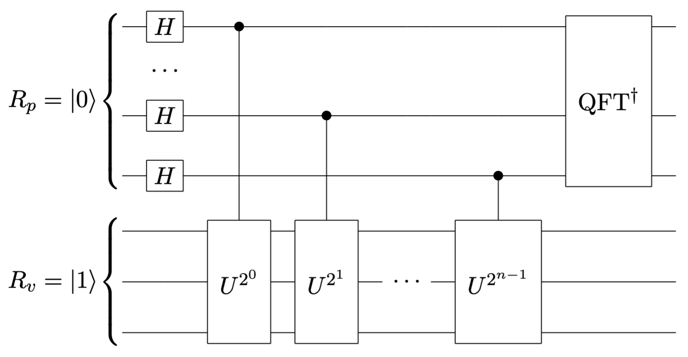
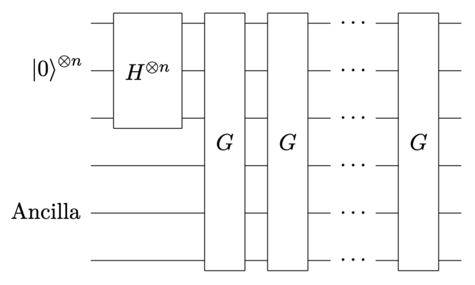
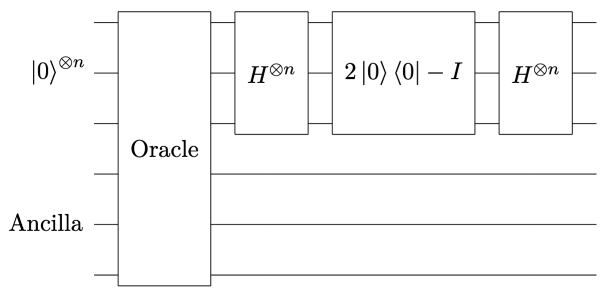

# Lab 3 Shor and Grover Algorithm
## 实验简介

本次实验中，我们将使用 `qiskit` 框架实现 Shor 算法 和 Grover 算法，并通过量子电路的模拟运行加深对这两个核心量子算法的理解。

### Shor 算法

Shor 算法是一种用于大整数分解的量子算法，通过量子相位估计算法来找到周期性，从而分解大整数。它是量子计算最具革命性的算法之一，展示了量子计算在解决经典计算难题中的优势。

Shor 算法通过将大整数分解问题转化为计算阶问题，从而实现量子加速。假设 $N$ 是待分解的大整数，$N = pq$，其中 $p$ 和 $q$ 是两个素数。任意选取整数 $a$，使得 $a$ 和 $N$ 互质，使用量子过程计算 $a$ 的阶 $r$，使得 $a^r \equiv 1 \mod N$。根据小端规则，基于 `qiskit` 的量子电路实现如下图所示：



其中

$
U|u_s\rangle = e^{\frac{2\pi is}{r}}|u_s\rangle
$

$
\frac{1}{\sqrt{r}}\sum_{s=0}^{r-1}|u_s\rangle = |1\rangle
$

### Grover 算法

Grover 算法是量子计算中用于搜索未排序数据库的量子算法，其具有平方加速，能够在 $O(\sqrt{N})$ 的时间内找到目标项。

待搜索的数据库由 Oracle 实现：

$
\text{Oracle}|x\rangle = (-1)^{f(x)}|x\rangle
$

其中 $x$ 为目标项时 $f(x)=1$ ，否则 $f(x)=0$。

Grover 算法通过反复作用 Grover 算子来增加目标项的振幅，从而实现搜索。其量子电路如下图所示：



其中 Grover 算子 $G$ 如下图所示：



其中 Ancilla 为实现 Oracle 可能使用的辅助量子比特。

## 实验要求

1. Shor 算法

```python
import numpy as np
from qiskit import QuantumCircuit, transpile
from qiskit.circuit.library import UnitaryGate, QFT
from qiskit.providers.basic_provider import BasicSimulator


def shor_circuit(N, a, n_p, n_v):
    qc = QuantumCircuit(n_p + n_v, n_p)

    for q in range(n_p):
        qc.h(q)
    qc.x(n_p)

    for q in range(n_p):
        exponent = 2 ** q
        ctrl_mod = mod_exp_circuit(a, exponent, N, n_v).to_gate().control(1)
        qc.append(ctrl_mod, [q] + list(range(n_p, n_p + n_v)))
    
    qc.append(QFT(n_p, inverse=True), range(n_p))

    qc.measure(range(n_p), range(n_p))
    return qc

def mod_exp_circuit(a, power, N, n_v):
    qc = QuantumCircuit(n_v)
    for _ in range(power):
        qc.append(mod_circuit(a, N, n_v), range(n_v))
    return qc

def mod_circuit(a, N, n_v):
    matrix = np.zeros((2 ** n_v, 2 ** n_v), dtype=int)
    # TODO complete modular multiplication circuit
    return UnitaryGate(matrix)


N = 15
a = 7
n_p = 3 # number of qubits in period register
n_v = 4 # number of qubits in value register
qc = shor_circuit(N, a, n_p, n_v)
print(qc.draw())

backend = BasicSimulator()
tqc = transpile(qc, backend)
result = backend.run(tqc).result()
counts = result.get_counts()
print("counts:", counts)

r = len(counts)
print(f"r: {r}")

if r % 2 == 0 and pow(a, r // 2, N) != N - 1:
    factor1 = np.gcd(pow(a, r // 2) - 1, N)
    factor2 = np.gcd(pow(a, r // 2) + 1, N)
    print(f"{N} = {factor1} * {factor2}")
else:
    print("Invalid a!")
```

- 以上代码使用 `qiskit` 部分实现了 Shor 算法，请补全 `mod_circuit` 函数中量子门 $U$ 对应的酉矩阵定义，以构造量子门
$
U|y\rangle = |ay(\text{mod}\ n)\rangle
$。
- 运行补全的代码，取 $a=7$，分解整数 $N=15$，观察输出的计数结果，验证分解结果是否正确。
- 修改代码中的部分参数，选取合适的 $a$，分解整数 $N=21$。

1. Grover 算法（选做 Bonus）

```python
def oracle():
    qc = QuantumCircuit(4)
    qc.cz(0, 3)
    return qc
```

- 以上代码定义了一个四量子比特的 Oracle 电路，分析该函数标记的目标态。
- 根据实验简介中的量子电路图，基于 `qiskit` 实现 Grover 算法，完成该 Oracle 目标项的搜索。
- 根据 Oracle 目标态和待搜索态的数量，选取合适的 G 算子迭代次数，观察 Grover 算法的搜索结果。
- 修改 Oracle 改变目标态的数量，尝试不同的 G 算子迭代次数，观寞 Grover 算法的搜索结果。