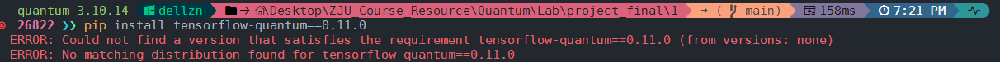

<!-- @format -->

# 量子神经网络实验

## 环境配置

1. 操作系统：Ubuntu 24.04 LTS Windows Subsystem for Linux 2
2. 编程语言：Python 3.10
3. 深度学习框架：tensorflow 2.15.0
4. 量子计算框架：tensorflow-quantum 0.11.0
5. 其他依赖：
   - cirq
   - numpy
   - matplotlib

## 安装步骤

```bash
# 创建并激活conda环境
conda create -n qml python=3.10
conda activate qml

# 安装主要依赖
pip install tensorflow==2.15.0
pip install tensorflow-quantum==0.11.0

# 安装其他依赖
pip install numpy matplotlib
```

**注意**：tensorflow-quantum 0.11.0 与 tensorflow 2.15.0 兼容。但目前仅提供 Linux 环境下的支持，因此 Windows 用户需要使用 WSL2 来运行实验。在 Windows 环境下直接安装 tensorflow-quantum 0.11.0 会报错。



## 运行说明

```bash
python qnn_mnist.py
```

## 实验结果

```
Epoch 1/3
158/324 [=============>................] - ETA: 40s - loss: 0.8813 - accuracy: 0.0388
```

## 参考资料

1. TensorFlow Quantum: https://tensorflow.google.cn/quantum/tutorials/mnist
